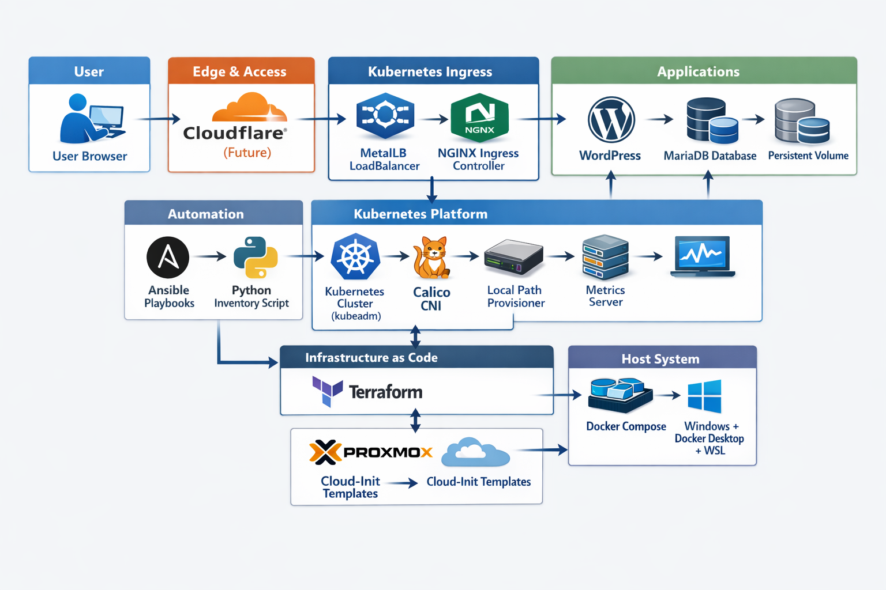

# Homelab Blog Platform

This repository contains a **self-hosted, production-style platform** built on **Proxmox, Kubernetes, and Cloudflare Zero Trust**.

It automates the full lifecycle of:
- Infrastructure provisioning  
- Kubernetes cluster bootstrap  
- Platform services deployment  
- Application delivery (Hugo-based blog)

> Designed to demonstrate **DevOps, Platform Engineering, and Solution Architecture principles** on homelab infrastructure.

---

## 🧠 Architecture Overview
GitHub (Markdown)
→ Kubernetes Hugo Job
→ NGINX
→ Ingress Controller
→ MetalLB (LoadBalancer)
→ Cloudflare Tunnel
→ Zero Trust
→ lennardjohn.org

### Infrastructure Pipeline

---

## ⚙️ Key Features

### ☸️ Kubernetes Platform
- 3-node Kubernetes cluster (kubeadm)
- Automated cluster bootstrap using Ansible
- Calico CNI networking
- Local Path Provisioner for storage

---

### 🌐 Networking & Access
- NGINX Ingress Controller
- MetalLB for bare-metal LoadBalancer support
- Cloudflare Tunnel + Zero Trust access

---

### 📊 Observability
- Prometheus + Grafana monitoring stack
- Metrics Server for cluster metrics

---

### 🧩 Application Layer
- Hugo-based static blog generation
- Markdown content stored in GitHub
- Kubernetes Job-based build process

---

### ⚡ Infrastructure as Code
- Terraform (Proxmox + Cloudflare)
- Dynamic VM provisioning via variables
- Cloud-init templates for rapid deployment

---

## 🔁 Resilient Deployment Design (Core Feature)

This platform is designed to **avoid fragile timing assumptions** commonly found in automation.

Instead of relying on fixed waits, it uses:

- Retry-based execution (`retries`, `delay`, `until`)
- Progressive readiness checks (pods exist → stabilise → proceed)
- Idempotent operations (`kubectl apply`, `helm upgrade --install`)
- Recovery-safe Kubernetes bootstrap (`kubeadm reset + retry`)

> The system is designed to **converge to a working state**, even on slow or constrained hardware.

---

## 🏗️ Folder Structure
homelab-blog/
├── terraform/ # Proxmox & Cloudflare infrastructure
├── ansible/ # Kubernetes bootstrap & platform deployment
├── kubernetes/ # Manifests (Ingress, WordPress, Monitoring, etc.)
├── blog/ # Markdown content + Hugo config
└── scripts/ # Helper scripts (deploy, trigger builds)

---

## 🚀 Getting Started

1. **Terraform**
   - Provision Proxmox VMs
   - Configure Cloudflare Tunnel + DNS

2. **Ansible**
   - Bootstrap Kubernetes cluster
   - Install platform services (Ingress, Storage, Monitoring)

3. **Kubernetes**
   - Deploy application stack (Hugo / WordPress)
   - Configure ingress and routing

4. **GitHub**
   - Push Markdown content
   - Trigger Hugo builds

5. Access your blog via:
    [Lennardjohn.org](https://lennardjohn.org/)

---

## 🧪 Lessons Learned

### ❌ What doesn’t work
- Fixed timeouts (`kubectl wait`)
- Sequential scripts with no retries
- Assuming immediate readiness

### ✅ What works
- Eventual consistency
- Retry + backoff strategies
- Layered system design
- Partial readiness checks

---

## 🎯 Why This Project Matters

This project demonstrates:

- Real-world DevOps practices  
- Platform engineering design patterns  
- Distributed system behaviour  
- Resilient automation on constrained infrastructure  

---

## 🔮 Future Improvements

- Multi-cluster deployment (Talos / cloud failover)
- CI/CD pipeline (GitHub Actions)
- Migration from Hugo → Next.js frontend
- External database management
- Full Cloudflare Zero Trust integration for all services

---

## ⚠️ Known Gotchas (Terraform + Proxmox)

This project includes a curated reference of non-obvious pitfalls:

👉 [`terraform-proxmox-gotchas.md`](terraform/proxmox/terraform-proxmox-gotchas.md)

Topics include:
- Proxmox API token permissions
- Disk cloning and template sizing pitfalls
- Cloud-init quirks
- Terraform provider limitations

---

## 👤 Author

**Lennard John**

- DevOps / Platform Engineering journey  
- Head of Digital Technology (NZ)  
- Building real-world systems on homelab infrastructure  

---

## 💬 Interview Talking Point

> “I designed this system to be resilient rather than deterministic.  
> Instead of relying on timing assumptions, I implemented retry-based convergence so the platform can stabilise even on constrained hardware.”

---