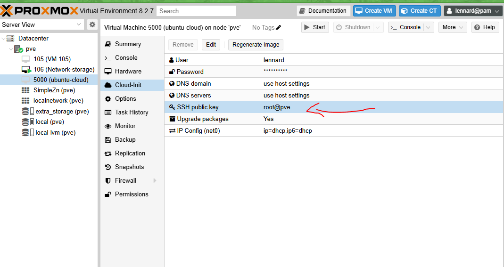
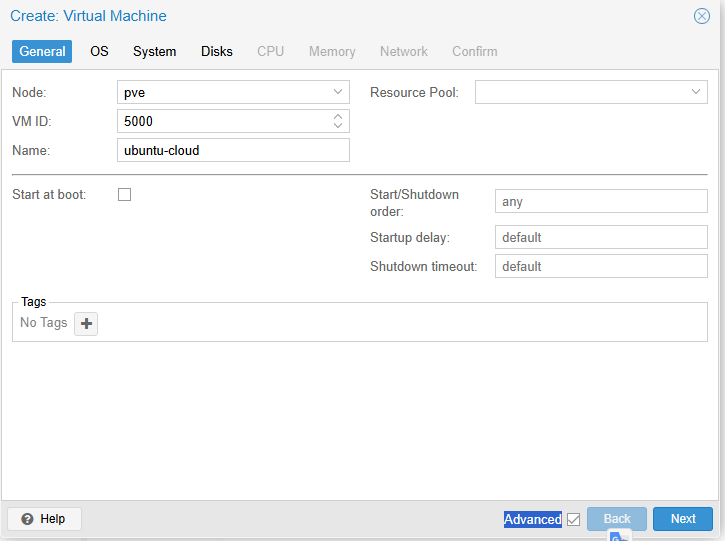
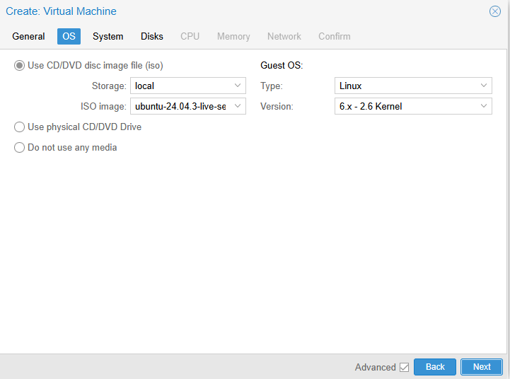
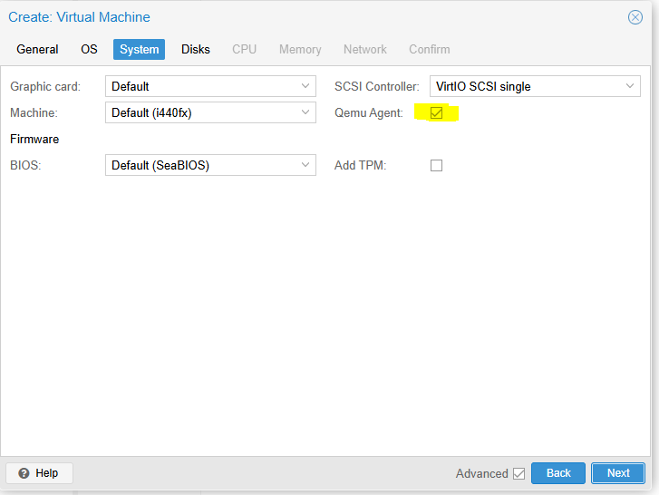
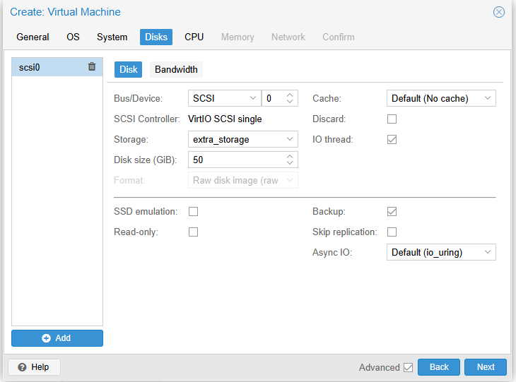
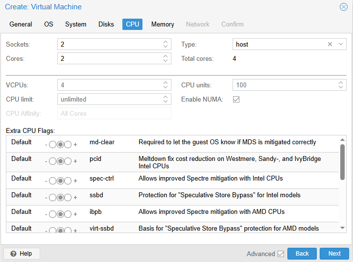
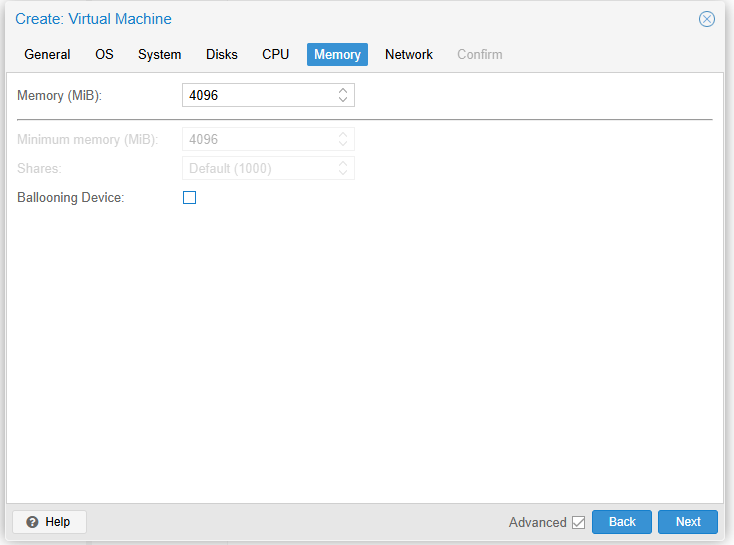
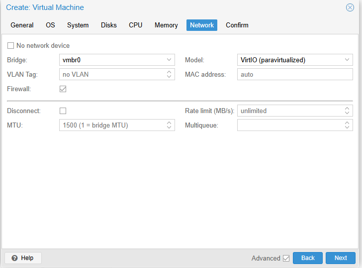
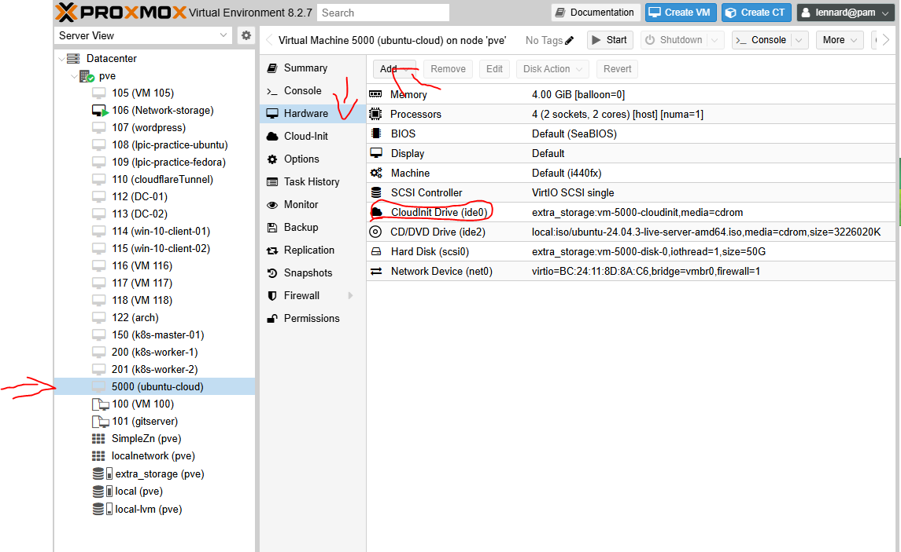
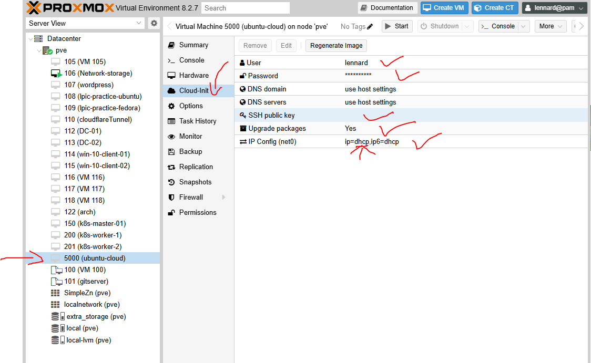

# Terraform - Proxmox & Cloudflare

## ⚠️ Important: Terraform + Proxmox Gotchas

Before modifying disk, cloud-init, or VM hardware settings, read:

👉 [`terraform-proxmox-gotchas.md`](.proxmox/terraform-proxmox-gotchas.md)

Proxmox templates and Terraform providers have several non-obvious behaviours that can result in:
- OS disks being detached during clone
- VMs booting without an OS
- Cloud-init settings silently not applying
- Serial console output not appearing in noVNC

This document explains *why* these issues occur and how to avoid them.


This folder contains the Terraform code for provisioning:

1. **Proxmox VMs** for a 3-node Kubernetes cluster
2. **Cloudflare DNS & Tunnel** for Zero Trust access

### Folder Structure

terraform/
├── proxmox/ # VM provisioning Tunnel and DNS setup
│ ├── main.tf
│ ├── variables.tf
│ ├── providers.tf
│ └── outputs.tf

# Recommendation
1. Use **_fucking cloudinit_**, after provisioning the VM on proxmox I had to manually go in and install each one. Again use fucking cloudinit. 
- Cleate a cloudinit template in proxmox, install and enable the `qemu guest agent` on each vm. This will allow promox to be able to grab the ip address.  

**Creating cloudinit template**

I found two ways to create a cloud-init template. Both of which has its advantage and disadvantages.

1. The first is from [Jim's Garage](https://www.youtube.com/watch?v=Kv6-_--y5CM) he uese the `qm` command 

- go to [Ubuntu cloud image](https://cloud-images.ubuntu.com/) and get the latest LTS version. For me it was  Ubuntu Server 24.03

Then follow these commands to set it up

```bash
# 0) (Optional) sanity checks
pvesm status
ip a show vmbr0

# 1) Create the VM shell
qm create 5000 \
  --name ubuntu-cloud \
  --memory 2048 \
  --cores 2 \
  --net0 virtio,bridge=vmbr0

# 2) Import the cloud image into local-lvm
# (Run this in the directory where the .img file lives, or use the full path)
qm importdisk 5000 jammy-server-cloudimg-amd64-disk-kvm.img local-lvm

# 3) Attach the imported disk as scsi0 (IMPORTANT: use volume-id, not a file path)
qm set 5000 \
  --scsihw virtio-scsi-pci \
  --scsi0 local-lvm:vm-5000-disk-0

# 4) Add the cloud-init drive
qm set 5000 --ide2 local-lvm:cloudinit

# 5) Set boot order to the imported disk
qm set 5000 --boot --boot-disk c scsi0

# 6) Serial console (nice for cloud images)
qm set 5000 --serial0 socket --vga serial0

# 7) Enable QEMU guest agent (recommended)
qm set 5000 --agent enabled=1

# 8) Cloud-init networking (DHCP)
qm set 5000 --ipconfig0 ip=dhcp

# 9) Cloud-init user + SSH key (recommended)
# Replace with the correct public key path ON YOUR PROXMOX HOST
qm set 5000 --ciuser ubuntu --sshkeys ~/.ssh/id_rsa.pub

```

- We will set up the cloud init, this is self explanitory. The only thing to watch out for is the ssh key. 
You should add your proxmox ssh keys so you are able to connect via the cousole.
You can find the keys at `/root/.ssh/ida_rsa.pub` this key is also needed to log in via putty and ssh



This method works but i has issues with booting. when terraform provision the three vm they don't auto start and when I start them manually they aren't recorded in the terraform state file. Meaning you can run `terraform destroy` but it would delete the vm on proxmox. If you run `terraform apply` multiple times it will just stop the already started vm.

So to conclude it would be a good option to provision multiplt vm quickly but it wouldn't be good to automatically get th IP addresses to send directly to an ansible configuration file.

2. This one was from [learn linux tv](https://www.youtube.com/watch?v=t3Yv4OOYcLs&list=PLT98CRl2KxKHnlbYhtABg6cF50bYa8Ulo&index=8) this one hopefully will fix all the previous problems

- Create a new VM







- Run some command to clean it out

```bash

```

- Add cloudinit drive 



- Add details to cloud init



- convert to template then clone it to begin